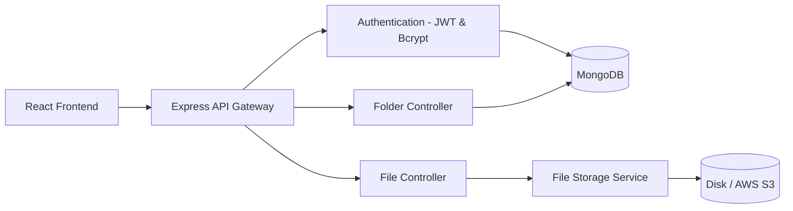
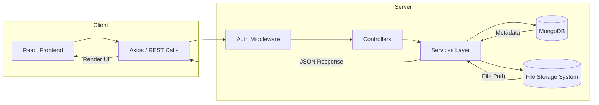
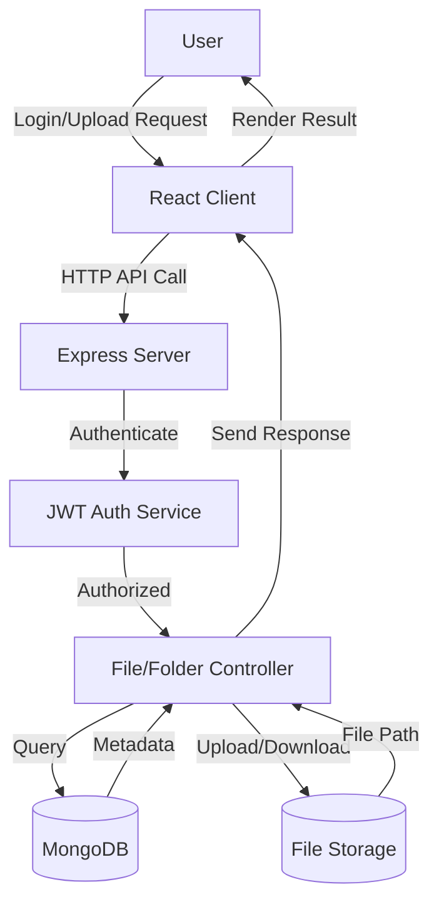

# CloudSafe | A Secure Cloud Storage Platform

**CloudSafe** is a modern **full-stack MERN cloud storage platform** that enables users to **securely upload, organize, and share files**.
Built with **MongoDB**, **Express**, **React**, and **Node.js**, providing a privacy-first experience backed by **robust authentication** and **optimized performance.**

Designed to replicate the functionality of professional storage systems, CloudSafe lets users **manage files, create folders, control shared access, and retrieve data** effortlessly — all within a **secure, scalable, and user-friendly cloud environment**.

---

## Key Features

- **User Authentication** – JWT-based signup and login flow for secure access.  
- **File Upload & Download** – Upload files of various types with real-time progress tracking.  
- **Folder Management** – Create, rename, and organize folders seamlessly.  
- **File Sharing & Access Control** - Share files with customizable access (private, public, or restricted). 
- **Search & Filter** – Find files instantly using metadata search.  
- **Responsive Design** – Built using React for consistent UX across devices.  
- **RESTful API** – Modular, versioned backend endpoints.  
- **Scalable Architecture** – Easily extendable for multi-user or enterprise deployments.

---

## **Architecture Diagram**



**Explanation:**

* The **React Frontend** communicates with the **Express API Gateway**.
* **JWT Authentication** secures endpoints.
* Controllers manage all operations — files, folders, and user logic.
* **MongoDB** stores metadata and user info; **Storage Layer** handles actual files.

---

## **System Design Diagram**



**Explanation:**

* Clean MVC-style separation: **Controllers → Services → Database/Storage**.
* Services handle core business logic.
* All responses are returned in **JSON**, rendered by React UI.

---

## **Data Flow Diagram**



**Explanation:**

* The **React frontend** sends user requests to the **Express backend**.
* The **backend authenticates** via JWT and processes through controllers.
* **MongoDB and storage** return data, which the frontend renders for the user.

---

## Folder Structure

```bash
CloudSafe/
│
├── Backend/
│   ├── api_controllers/
│   │   ├── authController.js
│   │   ├── fileController.js
│   │   ├── folderController.js
│   │   └── userController.js
│   ├── config/
│   │   └── db.js
│   ├── middlewares/
│   │   └── authMiddleware.js
│   ├── models/
│   │   ├── File.js
│   │   ├── Folder.js
│   │   └── User.js
│   ├── routes/
│   │   ├── authRoutes.js
│   │   ├── fileRoutes.js
│   │   └── folderRoutes.js
│   ├── utils/
│   │   └── helpers.js
│   └── server.js
│
├── frontend/
│   ├── src/
│   │   ├── components/
│   │   ├── pages/
│   │   ├── services/
│   │   └── App.js
│   └── package.json
│
└── README.md
```

---

## Tech Stack

| Layer                      | Technology                          |
| -------------------------- | ----------------------------------- |
| **Frontend**               | React.js, Axios, Redux Toolkit      |
| **Backend**                | Node.js, Express.js                 |
| **Database**               | MongoDB, Mongoose                   |
| **Authentication**         | JWT, Bcrypt                         |
| **File Storage**           | Local Storage / Cloud (S3 optional) |
| **Environment Management** | dotenv                              |
| **Version Control**        | Git, GitHub                         |

---

## Installation Guide

### 1. Clone the Repository

```bash
git clone https://github.com/Kritvi0208/CloudSafe.git
cd CloudSafe
```

### 2. Backend Setup

```bash
cd Backend
npm install
```

### 3. Frontend Setup

```bash
cd ../frontend
npm install
```

---

## Usage

### Start the Backend Server

```bash
cd Backend
npm run start_server
```

Backend runs on **[http://localhost:3500](http://localhost:3500)**

### Start the Frontend Server

```bash
cd frontend
npm start
```

Frontend runs on **[http://localhost:3000](http://localhost:3000)**

---

## Environment Variables

Create a `.env` file in your `/Backend` directory:

```env
PORT=3500
MONGO_URI=mongodb+srv://<username>:<password>@cluster.mongodb.net/cloudsafe
JWT_SECRET=your_jwt_secret
CLOUD_STORAGE_PATH=/uploads
```

---

## API Overview

| Endpoint                | Method | Description           |
| ----------------------- | ------ | --------------------- |
| `/api/auth/signup`      | POST   | Register a new user   |
| `/api/auth/login`       | POST   | Authenticate a user   |
| `/api/files/upload`     | POST   | Upload a new file     |
| `/api/files/:id`        | GET    | Retrieve a file by ID |
| `/api/files/delete/:id` | DELETE | Delete a file         |
| `/api/folders/create`   | POST   | Create a new folder   |
| `/api/folders/:id`      | GET    | Get folder contents   |

---

## Security Measures

* **JWT-based Authentication**
* **Bcrypt Password Hashing**
* **CORS Protection**
* **Rate Limiting**
* **File Type Validation**
* **Input Sanitization**
* **HTTPS Recommended in Production**

---

## Contributing

We welcome contributions that improve CloudSafe’s reliability, scalability, or UI/UX.

### Steps:

1. Fork the repository.
2. Create a new branch:

   ```bash
   git checkout -b feature/your-feature
   ```
3. Commit your changes:

   ```bash
   git commit -m "Add feature: your-feature"
   ```
4. Push the branch:

   ```bash
   git push origin feature/your-feature
   ```
5. Submit a pull request for review.

---

> CloudSafe — Secure, Scalable, and Smart Cloud Storage for Everyone.
